# Team Project Product Demonstration

This demonstration provides a comprehensive overview of the product, highlighting its core functionalities. The diet management software, as directed by Arogya, has the chief goal of providing an effective platform to plan dietary habits and manage one’s nutrition. The product's existing features include:
- Storing users' medical information such as height, weight, allergens, etc.
- User input about meals they consume, tracking their nutrient information (fats, proteins, carbs, hydration), application-assisted goals set by the user, as well as warning systems in place to ensure excessive or lack of consumption of a nutrient class does not occur.

## Features Demonstrated

The application has been developed in the High-Level programming language Python and utilizes an SQL database for information storage and retrieval.

### 1. Registration & Login

The application has login and registration functionality to offer users a safe and secure method of storing their pertinent information. This page serves as the initial point of interaction for users and is a gateway to an experience tailored to the end-users' needs.

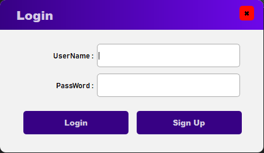

For returning users, the login screen provides a quick and efficient means of accessing their accounts. Users are prompted to input their registered username, password, and click the 'Login' button to gain entry to the application's full features. The login process is designed to be intuitive and user-friendly, minimizing any potential friction points for users.

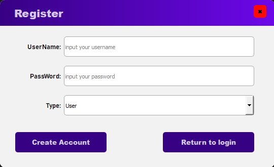

When accessing the app for the first time, users are presented with a straightforward registration process. The registration form collects essential user information, including username, password, and user type. This information is stored within the app's database, ensuring easy entry into the application through the login screen upon subsequent launches.

At this point in the application, the features implemented diverge depending on the type of user logging in. The types of users who can access the app are:
- End-user
- Nutritionist
- Administrator

### 2. End-User Features

#### Diet Record

The fundamental interactive capabilities of the diet management application lie in this tab of the User screen. The user can choose a particular date by clicking the date scroller to enter their food choice in. Within this date, they can choose which time of day they consumed their meal by pressing the (Breakfast, lunch, dinner, or a snack) and finish adding the meal by pressing the 'Add' button.

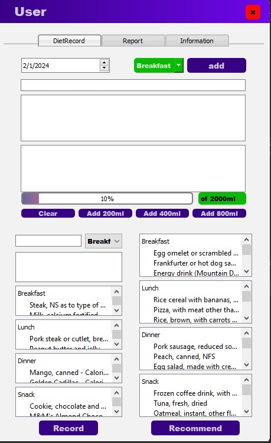

The user can also input the amount of water they consumed on a particular day, in their chosen quantities (200 ml, 400 ml, 800 ml), as well as a meter display showing their daily water intake goal.
The diet record tab also has a recommend button which gives the end-user a food item they can choose to consume if available. The end-user can also create their own meal plan by choosing specific food items. They can also view the nutrient information of each item.

#### Report

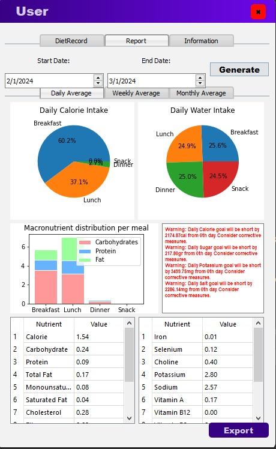

The report is the core analytical feature of the product. The user can select their interested date range and click 'Generate' to receive reports on their food intake and nutrient consumption habits. It also warns the end-user if their nutrient intakes will exceed or fall short of their goal. The date range also has preset buttons the user can click for a daily, weekly, or monthly average and receive varied reports like pie charts, line graphs and stacked column charts for efficient visualisation of consumption habits. The user can also click the 'Export' button to convert their diet report into a PDF format document and download it.

#### User Information

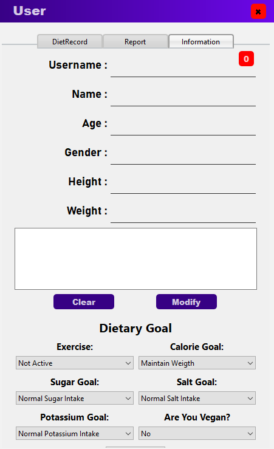

The information tab serves as a critical component of our diet app, providing users with a seamless interface to input vital information critical to their health and wellness journey. With a focus on customization, this tab encompasses a range of fields designed to gather key user data accurately and efficiently.
Users can change their username, name, age, and gender on this tab. They can change medical information such as height and weight. Finally, the user can also change their dietary goal such as their exercise frequency, calorific goal, sugar, salt, and potassium intake levels and if they are vegan or not. The user information tab provides a user-centric and holistic approach to the diet management application.

### 3. Nutritionist Features

#### Managerial Tab

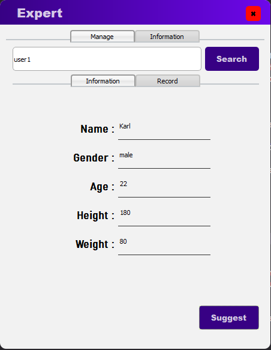

A nutrition expert has access to a 'Manage' tab. It consists of two tabs, 'Information' and 'Record'. There is an input box where the nutritionist can type the username of their client and the 'Information' tab will subsequently display the information associated with the given username.

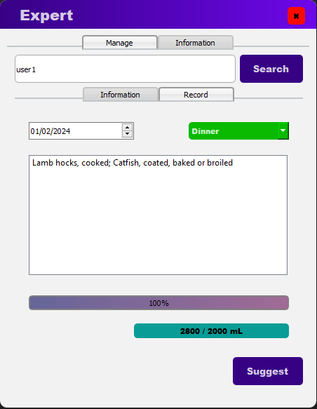

Under the 'Record' tab, they can find the nutrition information on a given date, which the nutritionist can customize by adjusting the date slider. They can also check the type of meal consumed, as well as the water intake.

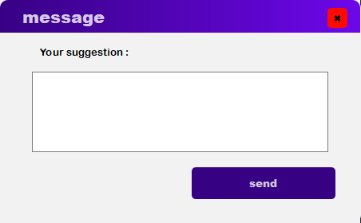

The nutritionist also has a 'Suggest' button which they can click to send a message to the end-user they are inspecting.

#### Information Tab

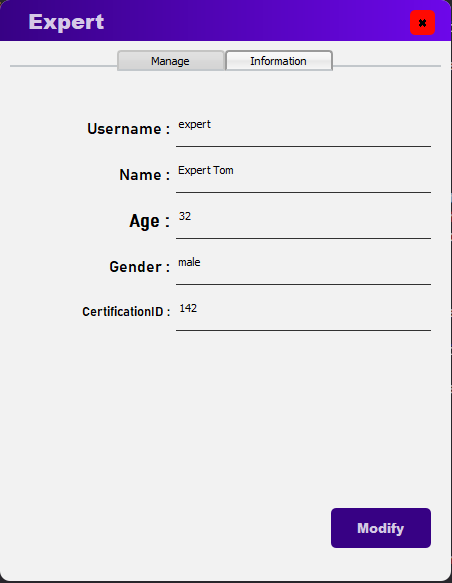

The precursor information tab shows the pertinent information of the nutritionist, similar to the user information tab in the end-user account type. The nutritionist can click the 'Modify' button to change their information.

### 4. Administrator Features

#### Managerial Tab

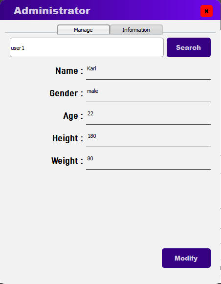

The administrator can search for the end-users' information in the input box provided and modify it.

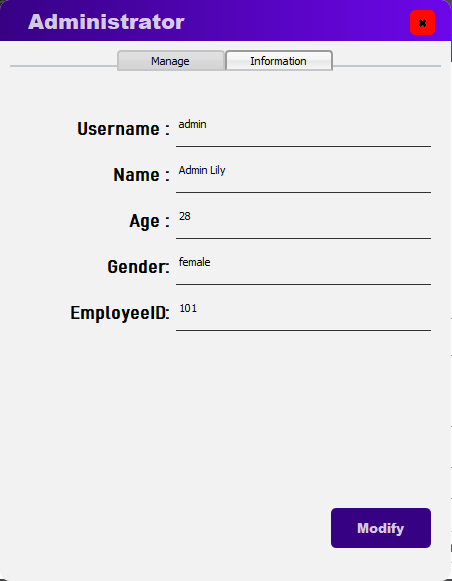

## Conclusion

Our diet management app offers a comprehensive solution for individuals seeking to improve their dietary habits and achieve their health goals. With its personalized approach, integration of straightforward communication between end-users and nutritionists and seamless analysis of lifestyle habits tracking, the app empowers users to make informed choices and sustain long-term behavior change. Through this demonstration, we aim to showcase the app's potential to positively impact users' lives and contribute to healthier communities.